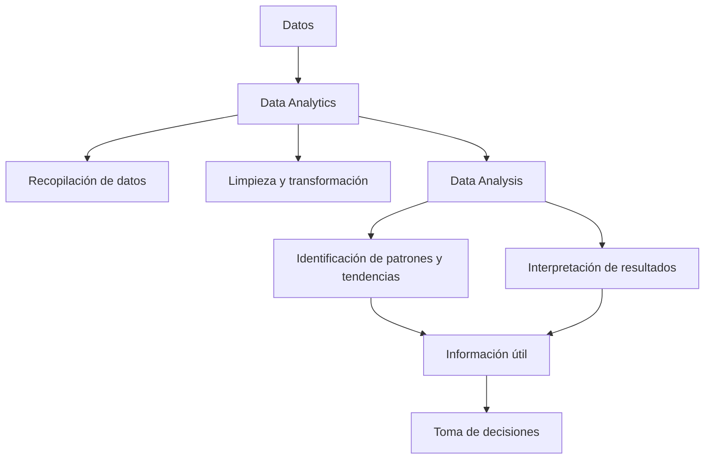

# Ejercicio 1.8: Relación entre Data Analytics y Data Analysis

## Relación entre Data Analytics y Data Analysis

**Data Analytics (análisis de datos)** y **Data Analysis (análisis de datos)** están estrechamente relacionados, pero no son exactamente lo mismo.

**Data Analytics** es un concepto más amplio que incluye el proceso de recopilar, limpiar, transformar, analizar e interpretar datos para obtener información útil y apoyar la toma de decisiones.

**Data Analysis** es una parte fundamental de Data Analytics. Se enfoca principalmente en examinar los datos para identificar patrones, tendencias, relaciones y conclusiones que permitan comprender mejor la información.

En otras palabras, **Data Analysis forma parte de Data Analytics** y proporciona información que puede utilizarse para tomar mejores decisiones.

## Diagrama de la relación

## Ejemplo práctico

Una empresa tiene datos sobre las ventas de sus productos.

- **Data Analytics:** Se encarga del proceso completo de trabajar con esos datos, desde su recopilación y preparación hasta la obtención de información útil para la empresa.
- **Data Analysis:** Examina las ventas para identificar cuáles son los productos más vendidos, qué meses tienen mayores ventas y qué factores pueden estar relacionados con los cambios en las ventas.
- **Resultado:** La empresa utiliza esta información para tomar decisiones, como aumentar el inventario de los productos con mayor demanda.
