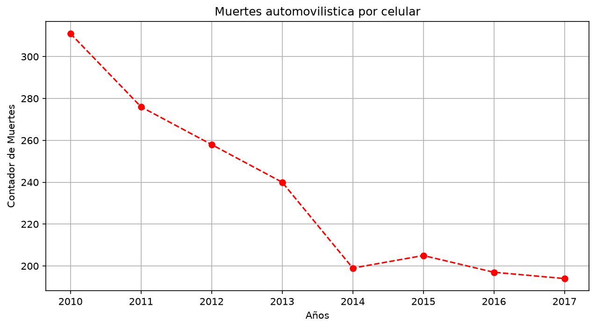
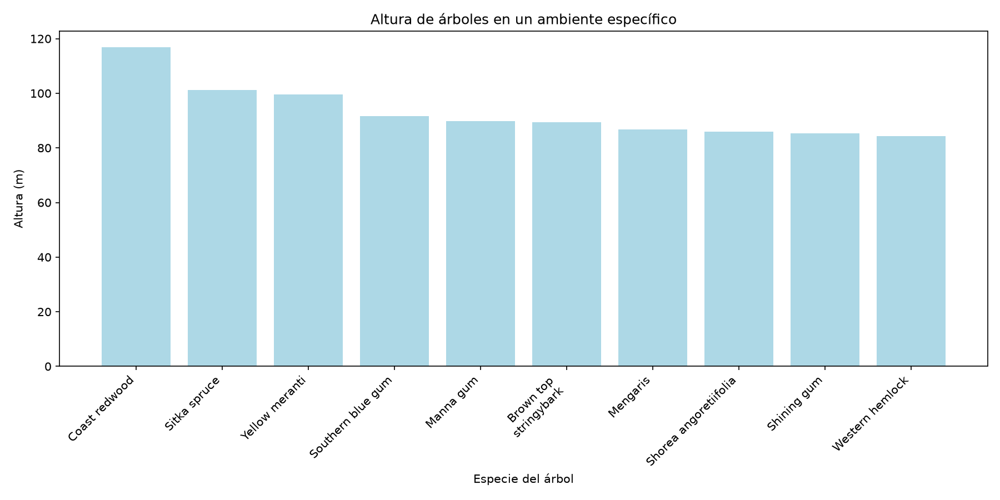
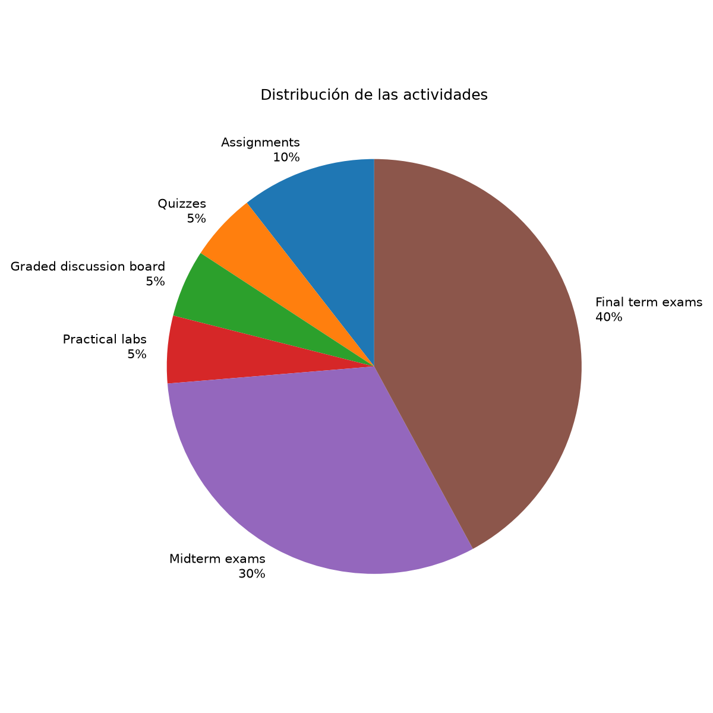
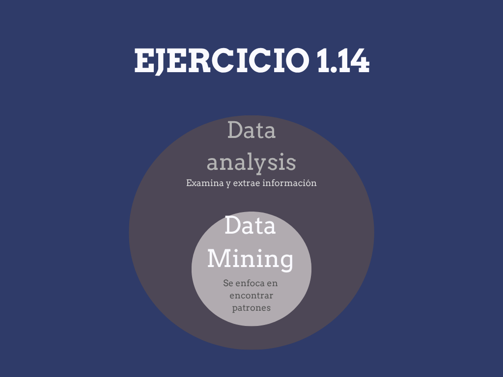
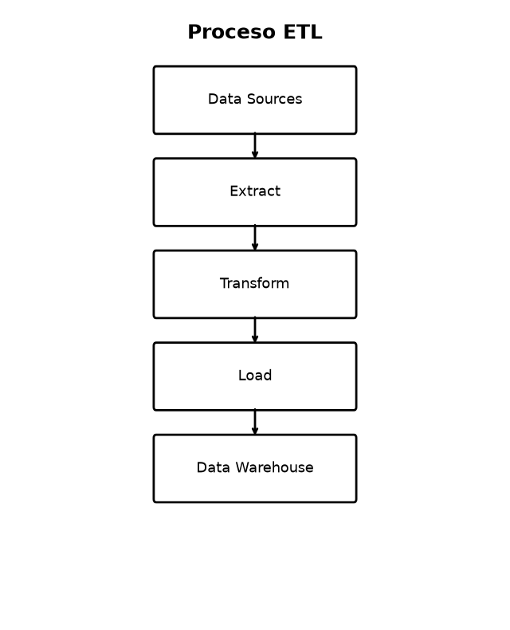

# Introducción a Ciencia de Datos

## Ejercicio 1.1

## Ejercicio 1.2

## Ejercicio 1.3

## Ejercicio 1.6
[Descargar el diagrama del proceso BI](Ejercicios/Ejercicio_1.6.pdf)

## Ejercicio 1.14

## Ejercicio 1.17

## Ejercicio 1.20
[Fases Desordenadas](Ejercicios/Ejercicio_1_20.pdf)

